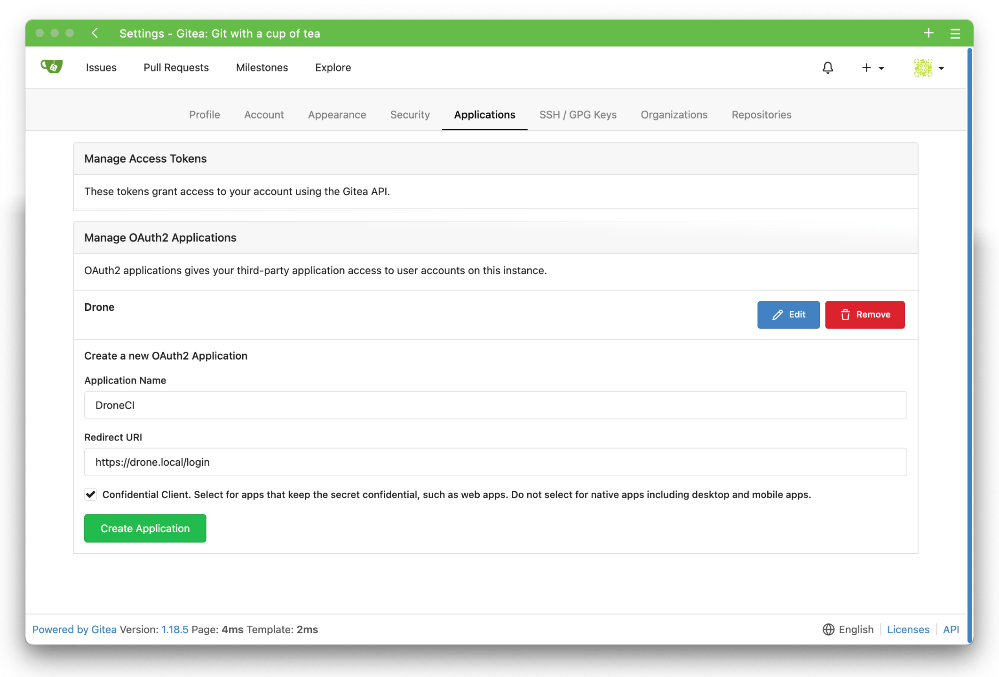

Gitea er et verktøy for å hoste sine egne git repositories.

DroneCI er et byggelinje verktøy for å bygge applikasjoner etter definisjoner.

Disse to spiller på lag, slik at hver commit til Gitea starter et bygg i DroneCI.

Når du nå åpner ArgoCD i nettleseren vil du se en app som heter `app-of-apps` og som er ute av sync. Hvis du så trykker på synkroniser vil du se at den oppretter en Gitea, Drone server og Drone runner instans for oss.


```bash
brukernavn: gitea
passord: gitops
```

### Lag OAuth2 applikasjon i Gitea



Lag en OAuth2 applikasjon med følgende innstillinger:
```bash
Application Name: DroneCI
Callback URI: https://drone.local/login
```

Kopier `Client ID` og `Client Secret` og bruk de som override i ArgoCD for DroneCI etter installasjon i steget under.

# DroneCI

## Overskriv parametere
Gå inn i **ArgoCD** og overskriv parameterne til DroneCI for å bruke `Client ID` og `Client Secret` fra Gitea. Dette gjøres under **parametere** i prosjektet under **App Details**, og i **values** teksboksen.

Når du nå synkroniserer prosjektet vil ArgoCD installere DroneCI server og runner.
